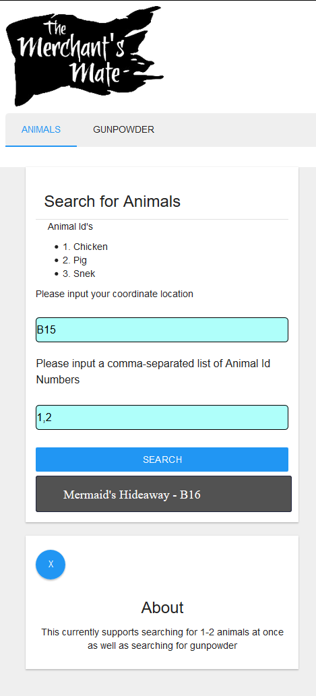
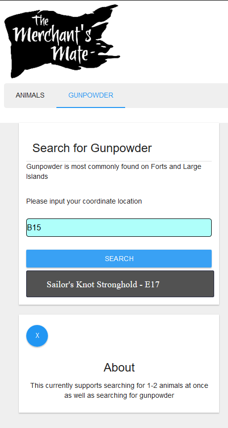

# MerchantHelper

A basic React application, originally intended for personal use to become more efficient while playing Sea of Thieves.

It consists of two screens, each containing both input and result views.

- Animal Finder Screen: Takes location and animal ids as inputs, displaying the closest standard island as a result.

- Gunpowder Finder Screen: Takes location as input, and displays the nearest fort as a result.

